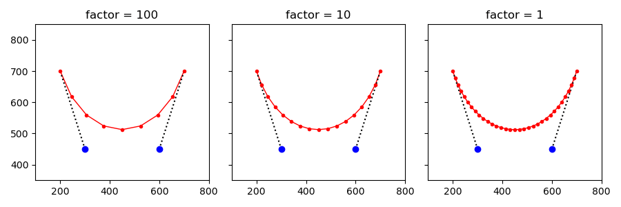
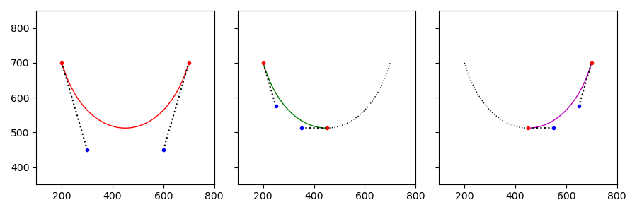
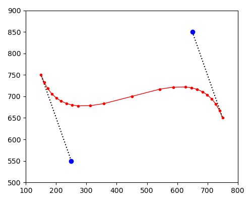
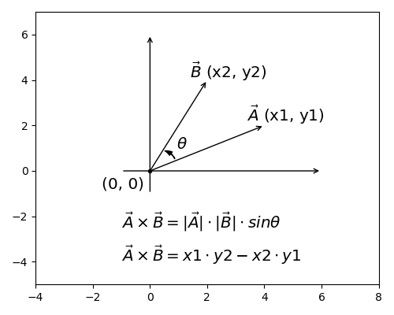
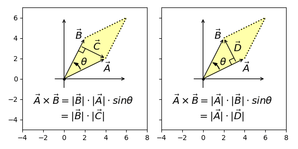
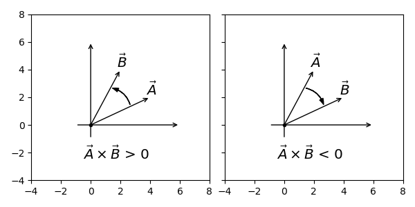
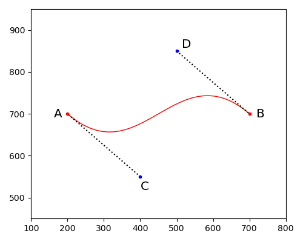
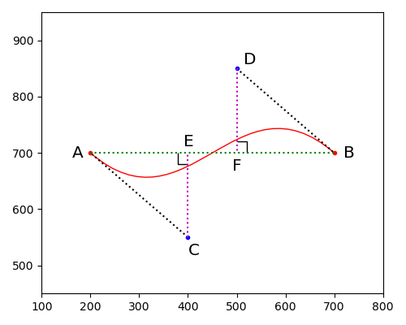
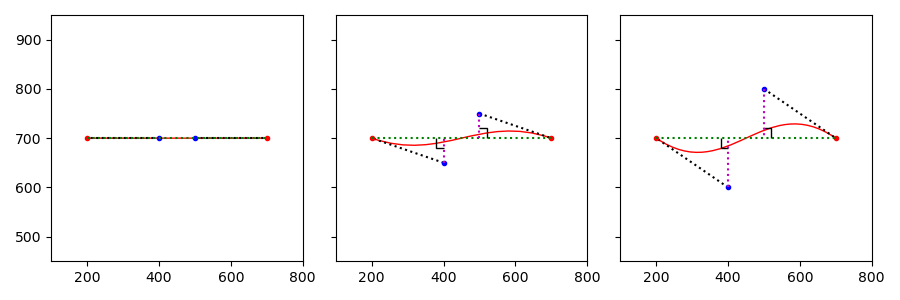

## 平直判断意义

绘制贝塞尔曲线时，通常用短线段连接而成，理论上线段越多越平滑。

利用`DeCasteljau`算法可以将任意曲线细分成两段，继续递归细分直到满足合适的平滑度。

有必要评价细分后的贝塞尔曲线是否足够"直"，因为弯曲处需要密集的短线段，而平直处不需要。

## 向量叉积定义

向量叉积公式如下，即两个向量模长乘积，再乘以其夹角的`sinθ`值。

向量叉积也有另一种解读，表述为向量形成的平行四边形面积，用初中数学知识可证和上面公式是等价的。

因为叉积公式有`sinθ`，所以两个向量形成的"面积"也带符号，简单总结为只有钝角或反向角的叉积都是负数。

## 平直判断详解

回到最初的问题，以四阶贝塞尔曲线为例，需要判断曲线是否足够直。

`Brushes`和`nanovg`都使用相同的算法，判断曲线足够直的表达式如下，其中`k`值是一个固定值。

$$
|\vec{AC} \times \vec{AB}| + |\vec{BD} \times \vec{AB}| < k \cdot |\vec{AB}|
$$

回顾叉积定义是平行四边形面积，可以把上述表达式中的叉积解读为线段模长相乘。

于是表达式转换如下，在进一步化简后，可以理解为比较控制点的偏离程度。

$$
|\vec{AC} \times \vec{AB}| + |\vec{BD} \times \vec{AB}| < k \cdot |\vec{AB}|
$$

$$
|\vec{CE}| \cdot |\vec{AB}| + |\vec{DF}| \cdot |\vec{AB}| < k \cdot |\vec{AB}|
$$

$$
(|\vec{CE}| + |\vec{DF}|) \cdot |\vec{AB}| < k \cdot |\vec{AB}|
$$

$$
|\vec{CE}| + |\vec{DF}| < k
$$

如果控制点没有偏离，贝塞尔曲线就退化为直线；偏离程度越大，弯曲程度也越大，也就更不适合以线段取代。

