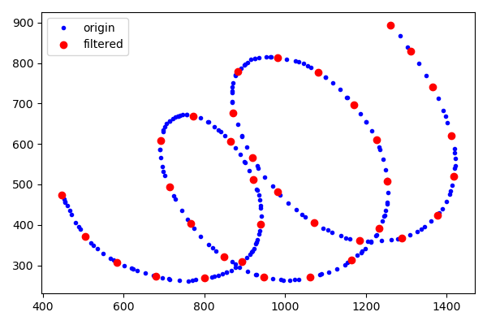
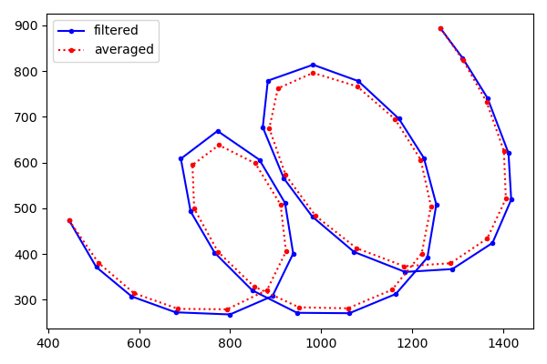
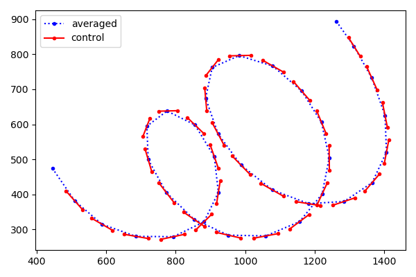
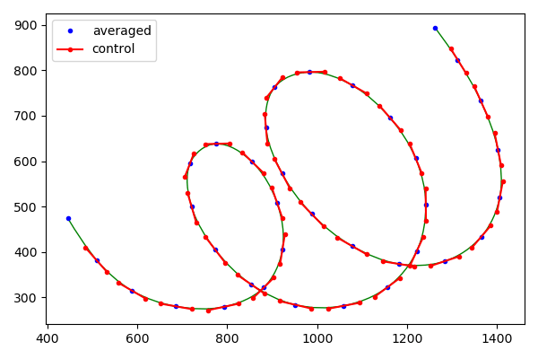
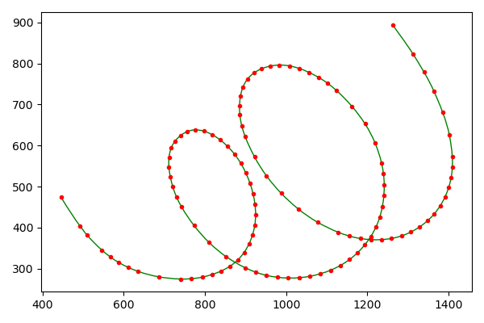
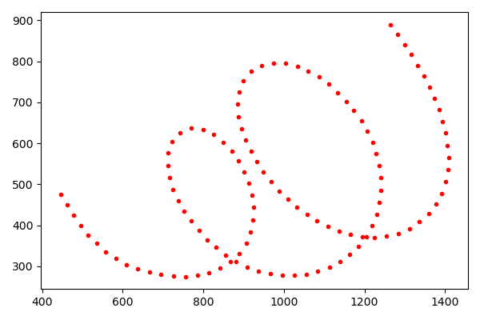
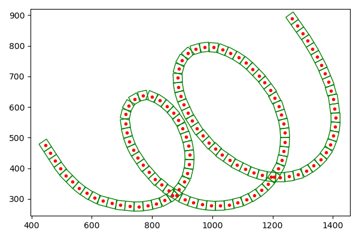
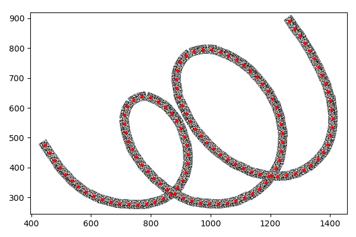

## 前言

### 起因

[Brushes](https://github.com/sprang/Brushes)是适用于`iPhone`和`iPad`的绘图软件，允许调整参数改变笔触样式。

因工作需求研读过源码，对特定领域的开发者可能有帮助，故整理并分享。

### 配图

都是用`matplotlib`生成，`Python`源码详见[github](https://github.com/fish47/fish47.github.io/tree/blog/content/post/inside-brushes/py)。

## 基本流程

### 简介

因为细节比较多，开篇先抛开代码，从宏观角度看一段笔迹如何生成。

对特定细节感兴趣的，可以查阅后续对应的分析文章。

当然也可以不求甚解，就当作看科普增长见识。

### 触点过滤

用户在触屏划出一段轨迹，有很多触点上报，但流程会按距离过滤，只有少量被采用。

### 触点滤波

过滤后的触点还会做滤波处理，其位置会发生改变。

如果把触点用线连起来，可以直观地看到滤波后的效果。

### 构建曲线

除首尾触点外，其余触点都可以计算出控制点。

根据这些控制点可以构建出平滑的书写曲线。

### 拉直曲线

在曲线上选取关键点，使得这些点相连后，看起来和原曲线差不多。

### 选取贴图点

在拉直的线段上，按特定距离选取贴图点。

### 计算贴图区域

以正方形贴图为例，贴图点是中点，而正方形本身还要跟随书写方向旋转。

### 填充贴图

用笔触贴图填充到对应位置，至此完成一段笔迹的绘制。

