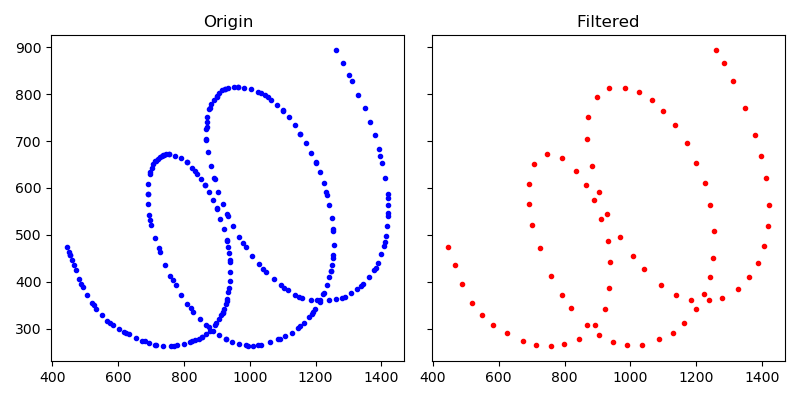
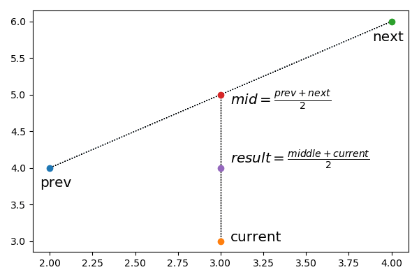
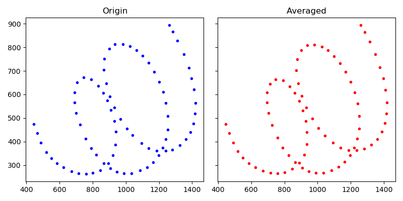
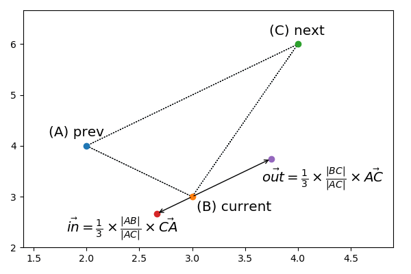
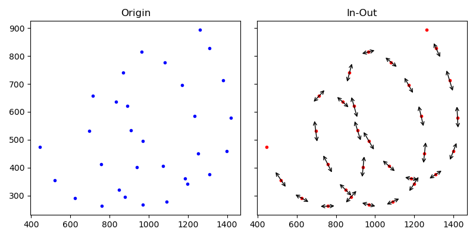

### 书写手势处理

书写相关的触摸事件由`WDCanvas`接收，事件类型可以类比为`MotionEvent`。

```objc
// WDCanvas.m

- (void) handlePanGesture:(WDPanGestureRecognizer *)sender
{
    ...
    if (sender.state == UIGestureRecognizerStateBegan) {
        // MotionEvent.ACTION_DOWN
        ...
        [[WDActiveState sharedInstance].activeTool gestureBegan:sender];
    } else if (sender.state == UIGestureRecognizerStateChanged) {
        // MotionEvent.ACTION_MOVE
        ...
        [[WDActiveState sharedInstance].activeTool gestureMoved:sender];
    } else if (sender.state == UIGestureRecognizerStateEnded) {
        // MotionEvent.ACTION_UP
        ...
        [[WDActiveState sharedInstance].activeTool gestureEnded:sender];
    } else if (sender.state == UIGestureRecognizerStateCancelled) {
        // MotionEvent.ACTION_CANCEL
        ...
        [[WDActiveState sharedInstance].activeTool gestureCanceled:sender];
    }
}
```

触点数据实际由`WDFreehandTool`处理。第一个触点按下时，将该点加入队列。

```objc
// WDFreehandTool.m

- (void) gestureBegan:(WDPanGestureRecognizer *)recognizer
{
    ...
    WDBezierNode *node = [WDBezierNode bezierNodeWithAnchorPoint:[WD3DPoint pointWithX:location.x y:location.y z:pressure]];
    pointsToFit_[0] = node;
    pointsIndex_ = 1;
    ...
}
```

随着触点移动，队列不断添加新触点，超过特定数量后则触发流程。

```objc
// WDFreehandTool.m

- (void) gestureMoved:(WDPanGestureRecognizer *)recognizer
{
    ...
    pointsToFit_[pointsIndex_++] = [WDBezierNode bezierNodeWithAnchorPoint:[WD3DPoint pointWithX:location.x y:location.y z:pressure]];

    if (pointsIndex_ == 3) {
        [self averagePointsFrom:1 to:2];
    }

    if (pointsIndex_ == 5) {
        [self paintFittedPoints:canvas];
    }
    ...
}
```

抬手后处理剩余的触点。

```objc
// WDFreehandTool.m

- (void) gestureEnded:(WDPanGestureRecognizer *)recognizer
{
    ...
    if (!self.moved) {
        WDBezierNode *node = [WDBezierNode bezierNodeWithAnchorPoint:[WD3DPoint pointWithX:location.x y:location.y z:1.0]];
        WDPath *path = [[WDPath alloc] init];
        [path addNode:node];

        [accumulatedStrokePoints_ addObject:node];

        [self paintPath:path inCanvas:canvas];
    } else {
        [self paintFittedPoints:canvas];
    }
    ...
}
```


### 点距过滤

接收新的触点前，会计算与上次接收触点的距离，如果距离太短则忽略。

```objc
// WDFreehandTool.m

- (void) gestureMoved:(WDPanGestureRecognizer *)recognizer
{
    ...
    CGPoint     location = [self documentLocationFromRecognizer:recognizer];
    float       distanceMoved = WDDistance(location, lastLocation_);

    // 点距过小则忽略
    if (distanceMoved < 3.0 / canvas.scale) {
        return;
    }
    ...

    // 用于下次判断点距
    lastLocation_ = location;
```

除非要求精细书写，否则处理密集触点的意义不大，而合适的取值对性能也帮助。




### 均值滤波

为了让触点更平滑，要执行一次平均化处理。

```objc
// WDFreehandTool.m

- (void) averagePointsFrom:(NSUInteger)startIx to:(NSUInteger)endIx
{
    for (NSUInteger i = startIx; i < endIx; i++) {
        WD3DPoint *current = [pointsToFit_[i].anchorPoint multiplyByScalar:0.5];
        WD3DPoint *prev = [pointsToFit_[i-1].anchorPoint multiplyByScalar:0.25];
        WD3DPoint *next = [pointsToFit_[i+1].anchorPoint multiplyByScalar:0.25];

        pointsToFit_[i].anchorPoint = [current add:[prev add:next]];
    }
}
```

以上流程用伪代码表示流程则如下。

```plain
curr = points[i]
prev = points[i-1]
next = points[i+1]
mid = (prev + next) / 2
result = (curr + mid) / 2
```

留意代码中的`0.25`和`0.5`系数，实际是公式整理后的结果。

```plain
result
= (curr + mid) / 2
= (points[i] + (points[i-1] + points[i+1]) / 2) / 2
= points[i] * 0.5 + points[i-1] * 0.25 + points[i+1] * 0.25
```

在坐标轴上可以直观看出数量关系。



如果没有跳变数据，均值滤波对原数据影响不大。




### 控制点计算

在构建曲线前，每个触点都要计算出`2`个控制点。

```objc
// WDFreehandTool.m

- (void) paintFittedPoints:(WDCanvas *)canvas
{
    ...
    for (int i = 1; i < loopBound; i++) {
        WD3DPoint *current = pointsToFit_[i].anchorPoint;
        WD3DPoint *prev = pointsToFit_[i-1].anchorPoint;
        WD3DPoint *next = pointsToFit_[i+1].anchorPoint;

        WD3DPoint *delta = [next subtract:prev];
        delta = [delta normalize];

        float inMagnitude = [prev distanceTo:current] / 3.0f;
        float outMagnitude = [next distanceTo:current] / 3.0f;

        WD3DPoint *in = [current subtract:[delta multiplyByScalar:inMagnitude]];
        WD3DPoint *out = [current add:[delta multiplyByScalar:outMagnitude]];

        pointsToFit_[i].inPoint = in;
        pointsToFit_[i].outPoint = out;
    }
    ...
}
```

这些向量计算不复杂，在坐标轴上看更直观。



首尾触点比较特殊，控制点与原点相同。

