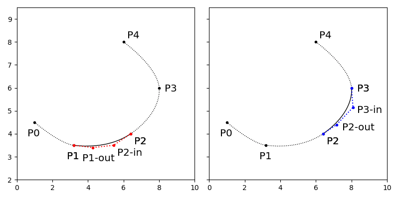
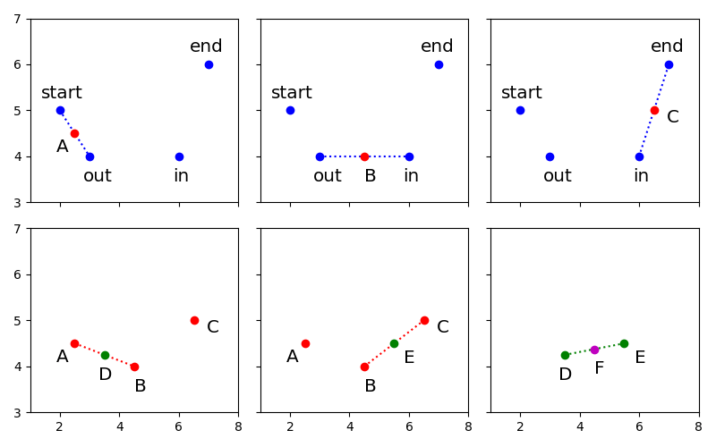
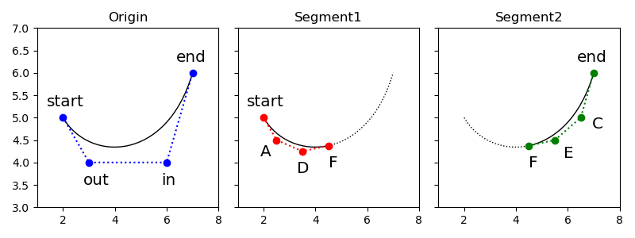
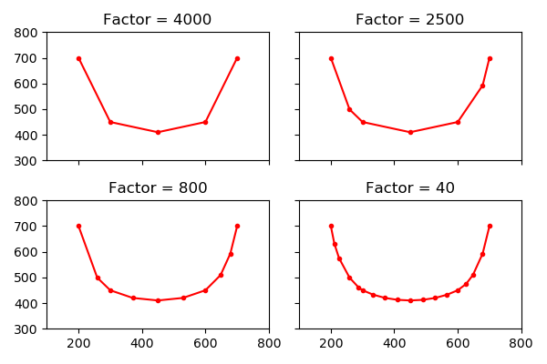
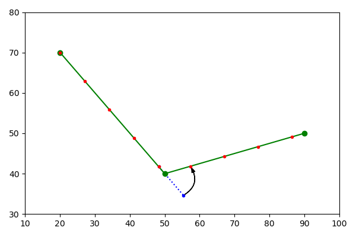
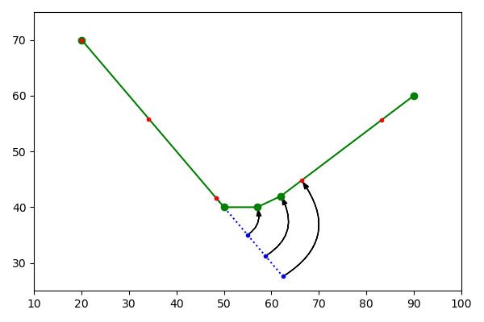

### 构迼曲线

当触点队列超量或处理抬手时，触点执行均值滤波和控制点计算后，会打包传递到曲线构造流程。

```objc
// WDFreehandTool.m

- (void) gestureMoved:(WDPanGestureRecognizer *)recognizer
{
    ...
    if (pointsIndex_ == 5) {
        [self paintFittedPoints:canvas];
    }
    ...
}

- (void) gestureEnded:(WDPanGestureRecognizer *)recognizer
{
    ...
    if (!self.moved) {
        ...
    } else {
        [self paintFittedPoints:canvas];
    }
    ...
}

- (void) paintFittedPoints:(WDCanvas *)canvas
{
    ...
    NSMutableArray *nodes = [NSMutableArray array];
    for (int i = 0; i <= drawBound; i++) {
        [nodes addObject:pointsToFit_[i]];
        ...
    }
    WDPath *path = [[WDPath alloc] init];
    path.nodes = nodes;

    [self paintPath:path inCanvas:canvas];
    ...
}

- (void) paintPath:(WDPath *)path inCanvas:(WDCanvas *)canvas
{
    ...
    CGRect pathBounds = [canvas.painting paintStroke:path randomizer:randomizer_ clear:clearBuffer_];
    ...
}
```

两个触点之间都可以组成一条曲成。

```objc
// WDPath.m

- (CGRect) paint:(WDRandom *)randomizer
{
    ...
    if (self.nodes.count == 1) {
        ...
    } else {
        NSArray     *points = [self flattenedPoints];
        ...
    }
    ...
}

- (NSArray *) flattenedPoints
{
    ...
    NSInteger           numNodes = closed_ ? ... : nodes_.count - 1;
    ...
    for (int i = 0; i < numNodes; i++) {
        WDBezierNode *a = nodes_[i];
        WDBezierNode *b = nodes_[(i+1) % nodes_.count];

        segment = [WDBezierSegment segmentWithStart:a end:b];
        [segment flattenIntoArray:flatNodes];
    }
    ...
}
```

本质是四阶`Bezier`曲线，`4`个坐标取值如下。

```objc
// WDBezierSegment.m

+ (WDBezierSegment *) segmentWithStart:(WDBezierNode *)start end:(WDBezierNode *)end
{
    WDBezierSegment *segment = [[WDBezierSegment alloc] init];

    segment.start = start.anchorPoint;
    segment.outHandle = start.outPoint;
    segment.inHandle = end.inPoint;
    segment.end = end.anchorPoint;

    return segment;
}
```

例如`5`个触点可以构成的`4`条曲线，下图是其中`2`条曲线的构成。




### 拉直曲线

为了简化计算会用密集的线段代替`Bezier`曲线，不断切割曲线可枚举出曲线上的点。

```objc
// WDBezierSegment.m

- (void) flattenIntoArray:(NSMutableArray *)points
{
    if ([self isFlatWithTolerance:kDefaultFlatness]) {
        if (points.count == 0) {
            [points addObject:self.start];
        }
        [points addObject:self.end];
    } else {
        WDBezierSegment *L = [[WDBezierSegment alloc] init];
        WDBezierSegment *R = [[WDBezierSegment alloc] init];

        [self splitAtT:0.5f left:&L right:&R];

        [L flattenIntoArray:points];
        [R flattenIntoArray:points];
    }
}
```

对于每一轮切割，实际是生成新控制点的过程。

```objc
// WDBezierSegment.m

- (WD3DPoint *) splitAtT:(float)t left:(WDBezierSegment **)L right:(WDBezierSegment **)R
{
    WD3DPoint *A, *B, *C, *D, *E, *F;

    // A = start * (1 - t) + out * t
    // B = out * (1 - t) + in * t
    // C = in * (1 - t) + end * t
    A = [start add:[[outHandle subtract:start] multiplyByScalar:t]];
    B = [outHandle add:[[inHandle subtract:outHandle] multiplyByScalar:t]];
    C = [inHandle add:[[end subtract:inHandle] multiplyByScalar:t]];

    // D = A * (1 - t) + B * t
    // E = B * (1 - t) + C * t
    // F = D * (1 - t) + E * t
    D = [A add:[[B subtract:A] multiplyByScalar:t]];
    E = [B add:[[C subtract:B] multiplyByScalar:t]];
    F = [D add:[[E subtract:D] multiplyByScalar:t]];

    if (L) {
        (*L).start = start;
        (*L).outHandle = A;
        (*L).inHandle = D;
        (*L).end = F;
    }

    if (R) {
        (*R).start = F;
        (*R).outHandle = E;
        (*R).inHandle = C;
        (*R).end = end;
    }

    ...
}
```

整个计算过程用图可表示如下。



`Bezier`曲线有个特殊性质，由控制点计算出的控制点，描绘的新曲线是原曲线的分段。



因为切割点必定在曲线上，不断对曲线切割，可以一直细分直到合适的平滑度。




### 均分贴图点

`Bezier`曲线被转化为密集的线段，在内存中以坐标点列表的形式表示，贴图点计算要遍历这些线段。

```objc
// WDPath.m

- (CGRect) paint:(WDRandom *)randomizer
{
    ...
    if (self.nodes.count == 1) {
        ...
    } else {
        NSArray     *points = [self flattenedPoints];
        NSInteger   numPoints = points.count;

        for (NSInteger ix = 0; ix < numPoints - 1; ix++) {
            [self paintFromPoint:points[ix] toPoint:points[ix+1] randomizer:randomizer];
        }
    }
    ...
}
```

在线段上以固定距离"行走"以计算出贴图点，但线段不一定能整除，还要记录补偿距离，在下次遍历时抵消。

```objc
- (void) paintFromPoint:(WD3DPoint *)lastLocation toPoint:(WD3DPoint *)location randomizer:(WDRandom *)randomizer
{
    ...
    CGPoint start = WDAddPoints(lastLocation.CGPoint, WDMultiplyPointScalar(unitVector, remainder_));

    for (f = remainder_; f <= distance; f += step, pressure += pressureStep) {
        ...
        CGPoint pos = WDAddPoints(start, orthog);
        ...
        [points_ addObject:[NSValue valueWithCGPoint:pos]];
        ...

        step = MAX(1.0, brush.spacing.value * brushSize);
        start = WDAddPoints(start, WDMultiplyPointScalar(unitVector, step));
        ...
    }

    remainder_ = (f - distance);
}
```

补偿距离抵消可以理解为把多余的距离"折"到下一条线段。



如果贴图点的点距很长，或者短线段密集，有时甚至要"吃掉"几个线段后才能放一个贴图点。

