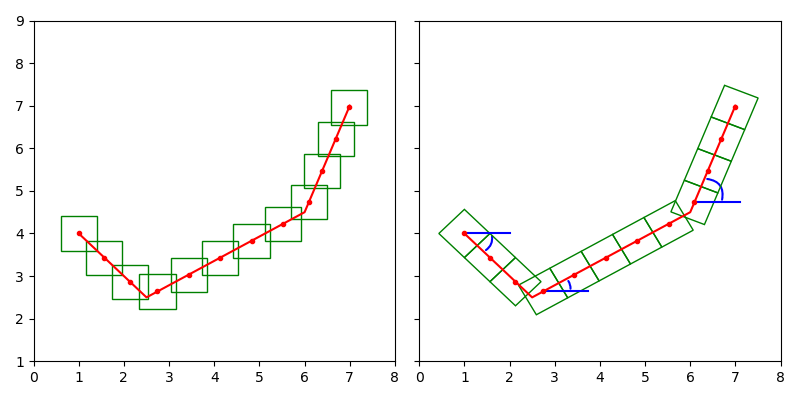
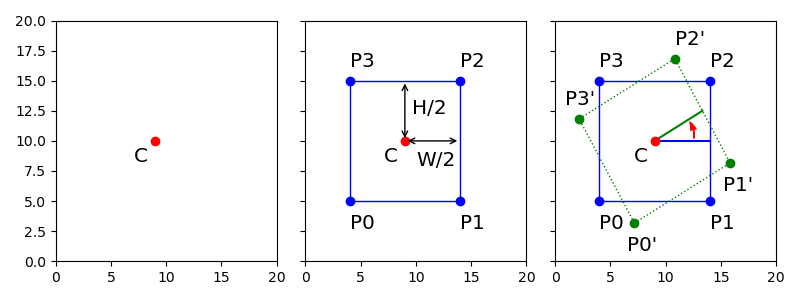
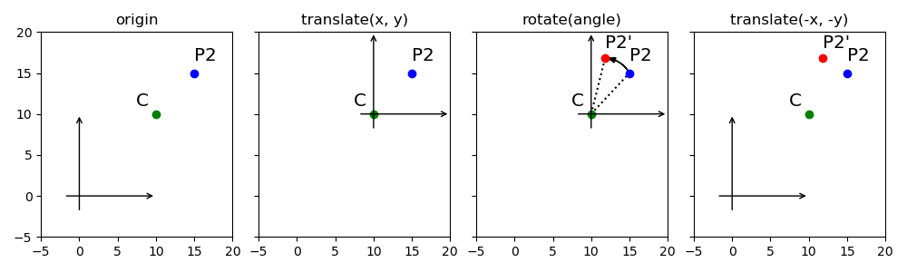
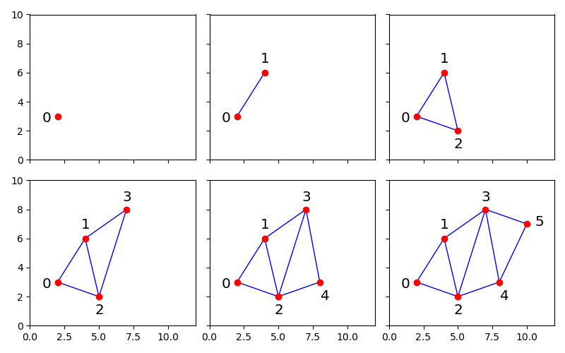
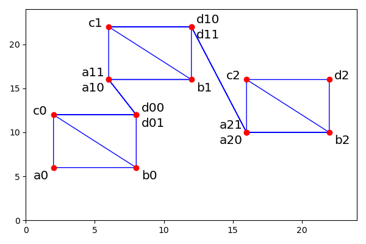
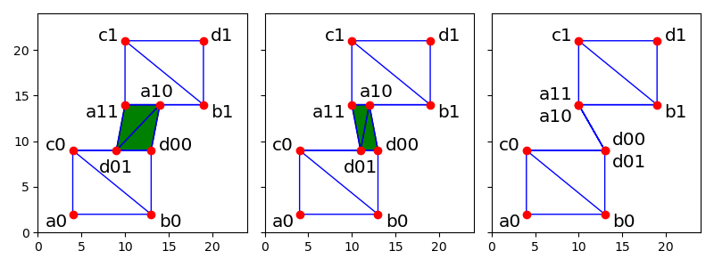

### 贴图自旋

遍历线段计算贴图点时，线段与水平的夹角会作为贴图的自旋角度。

```objc
// WDPath.m

- (void) paintFromPoint:(WD3DPoint *)lastLocation toPoint:(WD3DPoint *)location randomizer:(WDRandom *)randomizer
{
    ...
    CGPoint         vector = WDSubtractPoints(location.CGPoint, lastLocation.CGPoint);
    ...
    float           vectorAngle = atan2(vector.y, vector.x);
    ...
    for (f = remainder_; f <= distance; f += step, pressure += pressureStep) {
        ...

        // 某些笔触会影响自旋角度，此时可以暂时忽略
        float rotationalScatter = [randomizer nextFloat] * brush.rotationalScatter.value * M_PI * 2;
        float angleOffset = brush.angle.value * (M_PI / 180.0f);

        ...
        [points_ addObject:[NSValue valueWithCGPoint:pos]];
        [sizes_ addObject:@(brushSize)];
        [angles_ addObject:@(vectorAngle * brush.angleDynamics.value + rotationalScatter + angleOffset)];
        [alphas_ addObject:@(alpha)];
        ...
    }
    ...
}
```

如果加入贴图自旋，可以看到跟随书写方向的效果更自然。



后续流程把贴图点作为贴图矩形的中点，利用矩阵计算出自旋后的四角坐标。

```objc
// WDPath.m

- (CGRect) drawData
{
    ...
    for (int i = 0; i < points_.count; i++) {
        CGPoint result = [points_[i] CGPointValue];
        float angle = [angles_[i] floatValue];
        float size = [sizes_[i] floatValue] / 2;
        float alpha = [alphas_[i] floatValue];

        CGRect rect = CGRectMake(result.x - size, result.y - size, size*2, size*2);
        CGPoint a = CGPointMake(CGRectGetMinX(rect), CGRectGetMinY(rect));
        CGPoint b = CGPointMake(CGRectGetMaxX(rect), CGRectGetMinY(rect));
        CGPoint c = CGPointMake(CGRectGetMinX(rect), CGRectGetMaxY(rect));
        CGPoint d = CGPointMake(CGRectGetMaxX(rect), CGRectGetMaxY(rect));

        CGAffineTransform t = CGAffineTransformMakeTranslation(WDCenterOfRect(rect).x, WDCenterOfRect(rect).y);
        t = CGAffineTransformRotate(t, angle);
        t = CGAffineTransformTranslate(t, -WDCenterOfRect(rect).x, -WDCenterOfRect(rect).y);

        a = CGPointApplyAffineTransform(a, t);
        b = CGPointApplyAffineTransform(b, t);
        c = CGPointApplyAffineTransform(c, t);
        d = CGPointApplyAffineTransform(d, t);

        ...
    }
    ...
}

```

已知贴图点和矩形大小，再结合自旋角度，计算四角坐标的步骤如下图所示。



留意"绕某点旋转"的矩阵生成过程，平移和旋转操作有严格的先后顺序。




### 贴图顶点

计算出贴图的四角坐标后，会按顺序保存在顶点缓存中。

```objc
// WDPath.m

- (CGRect) drawData
{
    ...
    int n = 0;
    for (int i = 0; i < points_.count; i++) {
        ...

        // 自旋后的贴图四角坐标
        a = ...;
        b = ...;
        c = ...;
        d = ...;
        ...

        if (n != 0) {
            vertexD[n].x = a.x;
            vertexD[n].y = a.y;
            vertexD[n].s = 0;
            vertexD[n].t = 0;
            vertexD[n].a = alpha;
            n++;
        }

        vertexD[n].x = a.x;
        vertexD[n].y = a.y;
        vertexD[n].s = 0;
        vertexD[n].t = 0;
        vertexD[n].a = alpha;
        n++;

        vertexD[n].x = b.x;
        vertexD[n].y = b.y;
        vertexD[n].s = 1;
        vertexD[n].t = 0;
        vertexD[n].a = alpha;
        n++;

        vertexD[n].x = c.x;
        vertexD[n].y = c.y;
        vertexD[n].s = 0;
        vertexD[n].t = 1;
        vertexD[n].a = alpha;
        n++;

        vertexD[n].x = d.x;
        vertexD[n].y = d.y;
        vertexD[n].s = 1;
        vertexD[n].t = 1;
        vertexD[n].a = alpha;
        n++;

        if (i != (points_.count - 1)) {
            vertexD[n].x = d.x;
            vertexD[n].y = d.y;
            vertexD[n].s = 1;
            vertexD[n].t = 1;
            vertexD[n].a = alpha;
            n++;
        }
    }
    ...
    glDrawArrays(GL_TRIANGLE_STRIP, 0, n);
    ...
}
```

绘制模式是`GL_TRIANGLE_STRIP`，当顶点数大于等于`3`时，每增加`1`个顶点则与前`2`个顶点形成三个形。



每次输出四周坐标时有重复的顶点，如果使用上面的绘制模式，会发现矩形之间有细线相连。



留意重复点的作用，是把三角形折叠成不会显示的细线，方便批量绘制不相连的三角形。

